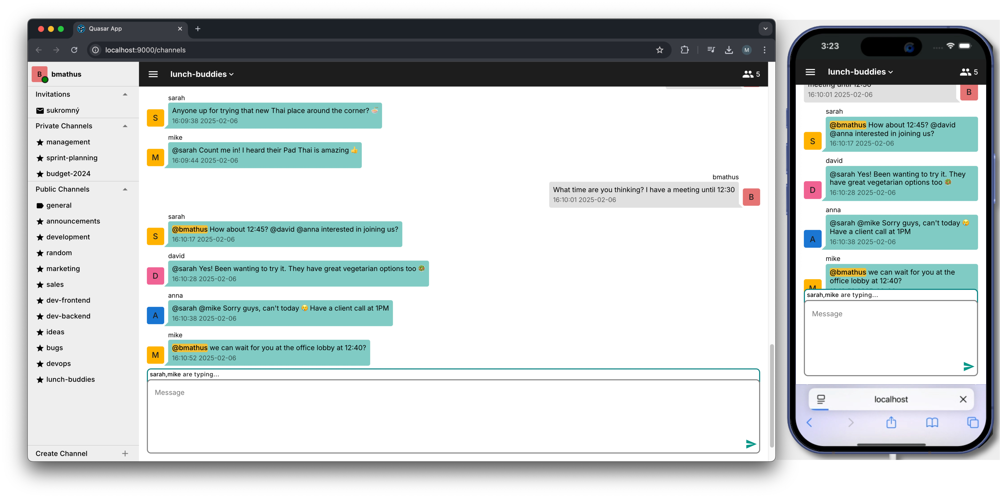
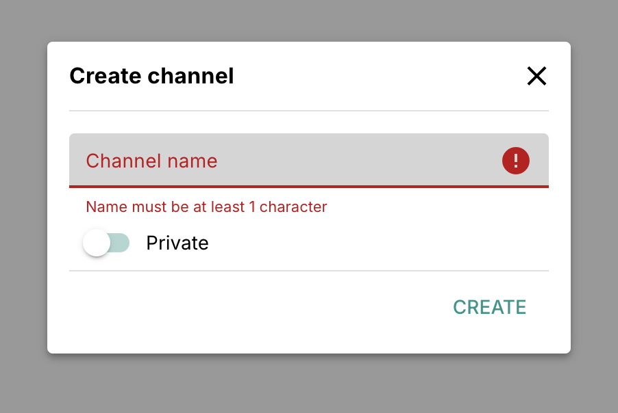
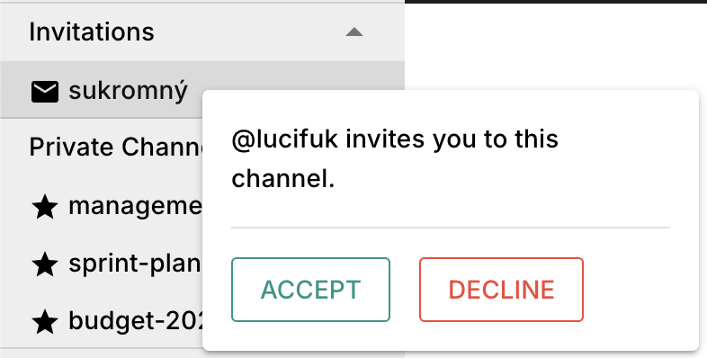
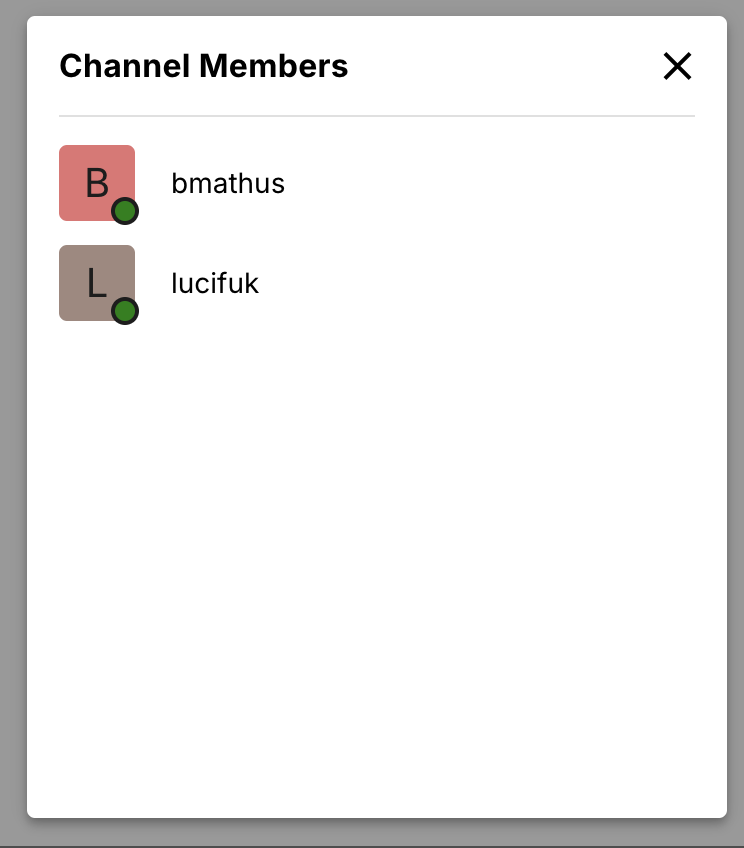
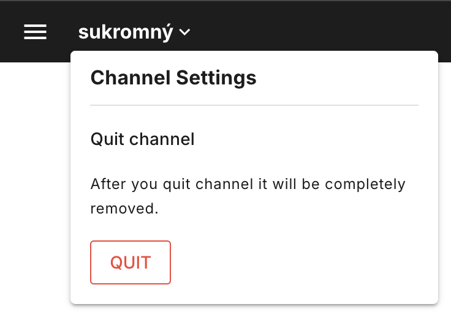
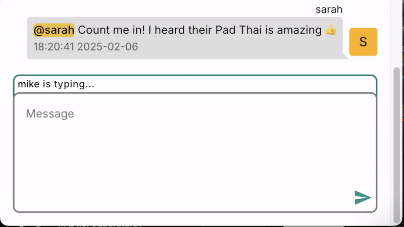
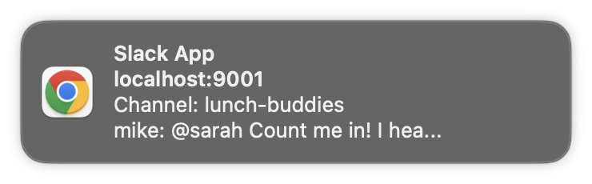
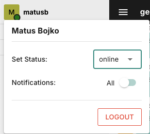

# Chat PWA

[]()
[]()
[]()
[]()
[]()
[]()
[]()
[]()

A real-time chat application PWA built with AdonisJS (backend) and Quasar Framework (frontend), featuring WebSocket communication for instant messaging.

Project was part of VPWA 2022/23 course at FIIT STU.



## Features

### Authentication

- User has `name`, `surname`, `nickName`, `email`, `password`
- User **registration**, **login** and **logout** with JWT tokens

### Channel System

Through UI or chat commands user can in general **create**, **join** or **leave** channel. For simplicity all members are part of generall channel. In left bar user can see channels that is part of or channels that he is invited in.

**Channel Roles:** Creator of the channel automatically becoms its **admin**. All other members are regular **users**.

App supports 2 possible types of channels: **private** or **public**.

**Public Channels** - are accesible to all users.

- Created through "Create channel" button or by chat command `/join channelName`
- Any user can join if channel exist with command `/join channelName`
- Any member can invite others using command `/invite nickName`

**Private Channels** - Invitation-only access

- Created through "Create channel" button or using `/join channelName private`
- Admin-controlled member management
  - Membership requires invitation from admin - `/invite nickName` and accpting the invite in the UI.
  - Admin can remove user from channel - `/revoke nickname`

<table>
  <tr>
    <td align="center" width="33%">
      
      <br>
      <em>Creating a new channel with public/private option</em>
    </td>
    <td align="center" width="33%">
      
      <br>
      <em>Accepting invitation to private channel</em>
    </td>
    <td align="center" width="33%">
      
      <br>
      <em>Channel members list with status indicators</em>
    </td>
  </tr>
</table>

**Channel leaving / removal**: Channel admin has right to **delete** channel with command `/quit`. User can leave channel with command `/cancel` (if admin does so its has the same effect as `/quit`).

<div style="text-align: left; margin: 40px 0;">
  
  <p><em>Channel deletion</em></p>
</div>

### Real-time chat messages

The application leverages WebSocket connections for real-time chat features:

- Instant message delivery
- View complete message history - efficient infinite scroll with pagination
- Live typing indicators ("User is typing...")
- Live message preview on nickname click
- Direct user mentions with @nickname - the message is highlighted for another user
- Immediate status updates
- Channel activity notifications (badges)
- Commands for all actions

<div style="text-align: left; margin: 40px 0;">
  
</div>

### Advanced Moderation

Three-strike kick system - a channel member can "kick" another member with `/kick nickName` command.

- in public channel if at least 3 members kick another member then the user is permanently banned from accessing the channel
- in private channel admin can permanently ban a user at any time with `/kick nickName` command, or conversely restore the user's access to the channel with the `/invite` command.

### Notifications

New message notifications when app is not visible (another tab, minimized window,..). Notification includes sender information and message preview.

Notification settings:

- Option to receive only @mentions
- No notifications in DND mode

Users can set **status** (online, DND, offline) which is shown to other. In DND no notifications are sent. I offline no notification and messages are sent and when switched to online all channels gets updated.

<table>
  <tr>
    <td align="center" width="33%">
      
      <br>
      <em>Notification example</em>
    </td>
    <td align="center" width="33%">
      
      <br>
      <em>User settings</em>
    </td>
  </tr>
</table>

## Tech Stack

### Backend

- AdonisJS 5
- PostgreSQL
- Socket.IO for real-time communication
- TypeScript

### Frontend

- Quasar Framework (Vue 3)
- Pinia for state management
- TypeScript
- Socket.IO client

## Setup Instructions

### Prerequisites

- Node.js 16.x
- npm 8.x or higher
- PostgreSQL 12 or higher
- Quasar CLI (`npm install -g @quasar/cli`)

### Backend Setup

1. Navigate to the backend directory:

   ```bash
   cd app-backend
   ```

2. Install dependencies:

   ```bash
   npm install
   ```

3. Copy the environment file and configure it:

   ```bash
   cp .env.example .env
   ```

   Configure the database connection and other environment variables in `.env`

4. Run database migrations:

   ```bash
   node ace migration:run
   ```

5. Start the development server:
   ```bash
   npm run dev
   ```
   The backend will run on http://localhost:3333

### Frontend Setup

1. Navigate to the frontend directory:

   ```bash
   cd app-frontend
   ```

2. Install dependencies:

   ```bash
   npm install
   ```

3. Start the development server:
   ```bash
   quasar dev
   ```
   The frontend will be available at http://localhost:9000
