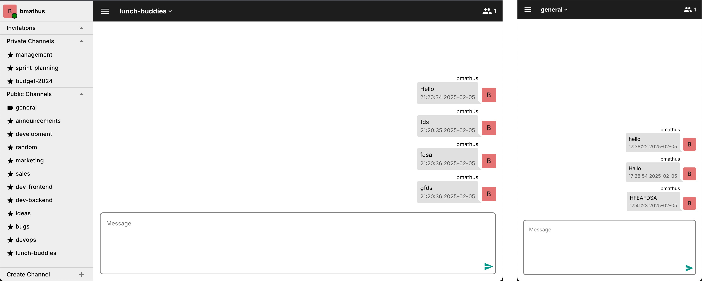

# Real-time Chat PWA

A real-time chat application PWA built with AdonisJS (backend) and Quasar Framework (frontend), featuring WebSocket communication for instant messaging.

Project was part of VPWA 2022/23 course at FIIT STU.

## Features

### Authentication

- User has `name`, `surname`, `nickName`, `email`, `password`
- User **registration**, **login** and **logout** with JWT tokens

### Channel System

Through UI or chat commands user can in general **create**, **join** or **leave** channel. For simplicity all members are part of generall channel. In left bar user can see channels that is part of or channels that he is invited in.

**Channel Roles:** Creator of the channel automatically becoms its **admin**. All other members are regular **users**.

App supports 2 possible types of channels: **private** or **public**.

**Public Channels** - are accesible to all users.

- Created through "Create channel" button or by chat command `/join channelName`
- Any user can join if channel exist with command `/join channelName`
- Any member can invite others using command `/invite nickName`

**Private Channels** - Invitation-only access

- Created through "Create channel" button or using `/join channelName private`
- Admin-controlled member management
  - Membership requires invitation from admin - `/invite nickName`
  - Admin can remove user from channel - `/revoke nickname`

<table>
  <tr>
    <td align="center" width="33%">
      
       
      <em>Creating a new channel with public/private option</em>
    </td>
    <td align="center" width="33%">
      
       
      <em>Inviting new members using command interface</em>
    </td>
    <td align="center" width="33%">
      
       
      <em>Channel members list with status indicators</em>
    </td>
  </tr>
</table>

**Channel leaving / removal**: Channel admin has right to **delete** channel with command `/quit`. User can leave channel with command `/cancel` (if admin does so its has the same effect as `/quit`).

  
  
<em>Your caption here - describing what's shown in the image</em>

